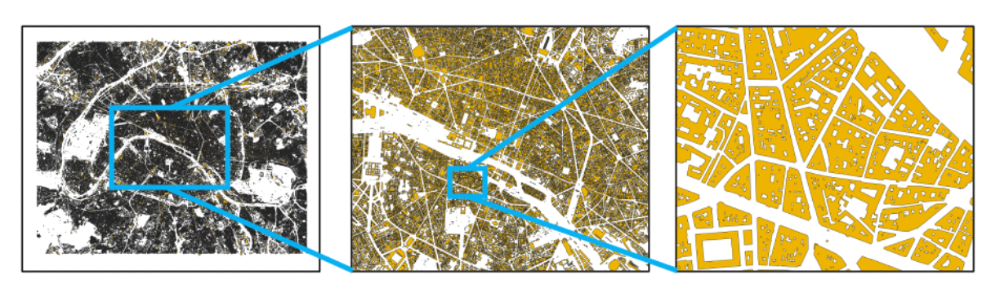
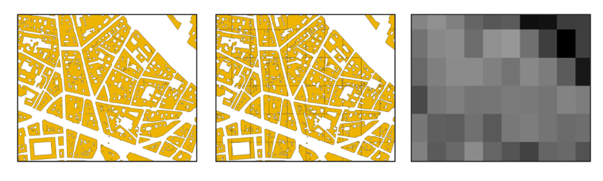
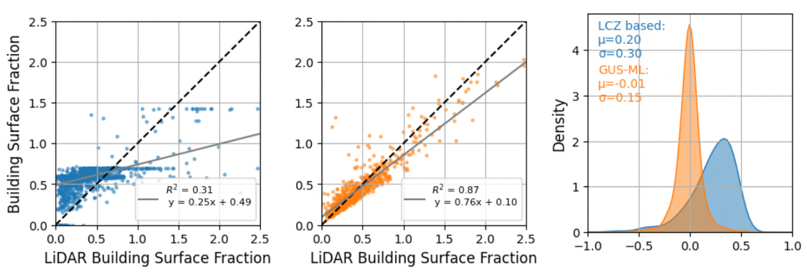

# GUS-ML: Global Urban Surface from LiDAR and Land Surface Data Using Machine Learning

GUS-ML is a reproducible geospatial pipeline to estimate the total building surface fraction (walls + roofs), also referred to as λ_B, using high-resolution LiDAR and open-source building footprints (OpenStreetMap and Microsoft Buildings). The method harmonizes these inputs into a global 100 m reference grid and trains a machine learning model using globally available land surface and urban datasets. This allows surface fraction estimation in regions without LiDAR, supporting better urban climate modeling and adaptation planning.

This pipeline was developed as part of an ESA AI4EO application on climate adaptation and Earth observation.

## Motivation

The total building surface area (walls + roofs) within each grid cell is a key parameter for urban climate models such as WRF, PALM, and TEB. It directly influences energy balance through heat storage, albedo, emissivity, and surface conductance. However, current methods estimate this parameter using Local Climate Zones (LCZs), which fail to capture fine-scale urban heterogeneity.

This project addresses this gap by building a high-resolution, machine learning-based λ_B predictor trained on LiDAR-derived data from five representative French cities.

## Cities Processed

- Paris  
- Lyon  
- Marseille  
- Grenoble  
- Nantes

Each city was processed from raw LiDAR (.laz) files to labeled 100 m grid cells with accurate λ_B values. These served as training and validation data for the model.

## Objectives

- Produce the first high-resolution, model-ready dataset of λ_B across France, aligned with a harmonized 100 m grid
- Derive λ_B from LiDAR and vector building geometries (OSM + Microsoft)
- Merge, buffer, and height-assign buildings based on rasterized roof and ground LiDAR data
- Aggregate wall and roof surface within each grid cell
- Train a supervised machine learning model using global datasets (e.g. WSF3D, LCZ, urban fraction)
- Validate against traditional LCZ-based analytical methods
- Generalize to areas without LiDAR

## Machine Learning Model

Target:  
λ_B = (roof area + wall area) / grid cell area

Input features:  
- WSF3D (mean and standard deviation of building height)
- Urban fraction (100 m)
- Plan area fraction (from OSM/Microsoft)
- LCZ classification
- Impervious surface
- Elevation and slope (Copernicus DEM)

All features were standardized and aligned to a common 100 m grid. No city-specific tuning was applied to ensure transferability.

Model:  
- Random Forest Regressor (scikit-learn)
- Trained using Leave-One-City-Out Cross-Validation (LOCO-CV)

## Validation and Comparison

Leave-One-City-Out cross-validation was used to test the model’s ability to generalize to unseen urban environments. In each fold, the model was trained on four cities and validated on the fifth.

Metrics:  
- R² (coefficient of determination)  
- RMSE (Root Mean Squared Error)

| City      | R² (ML) | R² (LCZ) | RMSE (ML) | RMSE (LCZ) |
|-----------|--------|----------|-----------|------------|
| Paris     | 0.87   | 0.31     | 0.06      | 0.13       |
| Lyon      | 0.83   | 0.34     | 0.07      | 0.12       |
| Marseille | 0.80   | 0.28     | 0.08      | 0.11       |
| Grenoble  | 0.86   | 0.36     | 0.06      | 0.10       |
| Nantes    | 0.84   | 0.29     | 0.07      | 0.12       |

### Example: Paris

The following example shows the application of the pipeline to the city of Paris, which was used as a test fold in the Leave-One-City-Out Cross-Validation (LOCO-CV) strategy. In this setup, the model was trained on data from Lyon, Marseille, Grenoble, and Nantes, and then applied to Paris without having seen any Paris data during training.

The local building geometries were retrieved from OpenStreetMap and the Microsoft Building Footprints dataset. These were merged and cleaned to avoid double-counting adjacent structures and to ensure that only exterior walls and roof surfaces were considered. The resulting geometries were assigned building height values based on the LiDAR-derived roof and ground rasters.

These geometries were then intersected with a harmonized 100 m grid, and their wall and roof surface areas were aggregated to produce λ_B values per cell, which serve as ground truth for evaluation.

Separately, the model trained on the other four cities used features such as WSF3D, LCZ, and urban fraction to predict λ_B values across the Paris grid. The predicted values were then compared to the LiDAR-derived λ_B to assess model accuracy.

Left: Paris metropolitan area coverage  
Center: Paris city center area with vector building geometries  
Right: Zoom into a city block showing building-level detail used in λ_B computation. The geometries are buffered merged and debuffered to ensure only exterior walls and surfaces are computed.

---

### From Building Geometry to λ_B

Once the geometries are merged, the are then intersected with the grid and assigned LiDAR-based building heights, calculating wall and roof surface areas. The grid used is a harmonised 100 m in gridsize used for prediction. This produces accurate, cell-based λ_B values for use in model training and validation.

Left: Merged building footprints  
Center: Intersected, and aggregated height-assigned geometries based on LiDAR  
Right: 100 m grid with computed λ_B (lighter = higher surface fraction)

---

### Comparison with LCZ-Based Estimation

For reference, we compare the ML predictions against a traditional method based on Local Climate Zones (LCZs) from the WUDAPT project, where each LCZ type is assigned a fixed λ_B value and spatially aggregated to the 100 m grid. The figure below compares both approaches to the LiDAR-derived ground truth.

Left: LCZ-based λ_B vs LiDAR reference clipped from 0 to 2.5.
Center: ML-predicted λ_B vs LiDAR  
Right: Distribution of residuals (LiDAR - method)

The ML model significantly outperforms the LCZ-based approach. It shows much higher agreement with the reference data (R² = 0.87 vs 0.31) and far lower bias and error spread. This confirms that data-driven estimation is more robust and better suited for heterogeneous urban environments.

---

## Outlook

Because all the predictor variables used in this model are available nationally—and in many cases globally—the trained model can be used to generate continuous λ_B predictions beyond the five cities studied here. This enables the creation of a wall-to-wall surface fraction dataset for the entire country.

To extend the method to the European or global level, the training dataset would need to be expanded with a representative sample of cities across different climates, urban morphologies, and socio-spatial structures. This would allow for broader generalization while preserving the accuracy benefits of LiDAR-calibrated training. The result would be the first high-resolution, globally consistent, model-ready dataset of total urban surface fraction—unlocking new possibilities for urban climate modeling, exposure mapping, and Earth observation–driven adaptation planning.

## License

This project is released under the MIT License.  
You are free to use, adapt, and share the code for research or non-commercial purposes. Please cite appropriately if used in publications.

---

## Contact

Developed by Jacobo Gabeiras  
PhD candidate in urban climate modeling and geospatial data science  
Email: gabeiras3j@gmail.com  
GitHub: [@gabeiras3j](https://github.com/gabeiras3j)

---

## Citation

If you use this work, please cite:

> Gabeiras, J. (2025). GUS-ML: Estimating Urban Surface Fraction from LiDAR and Global Data Using Machine Learning. *GitHub Repository*. https://github.com/gabeiras3j/urban-surface-ml

---

## Acknowledgements

This project was developed in the context of an ESA AI4EO application on urban climate adaptation.  
It uses data from:  
- IGN LiDAR  
- OpenStreetMap  
- Microsoft Building Footprints  
- World Settlement Footprint 3D (DLR)  
- Copernicus DEM  
- LCZ Global and related datasets

Special thanks to the open data and Earth observation communities that made this work possible.
